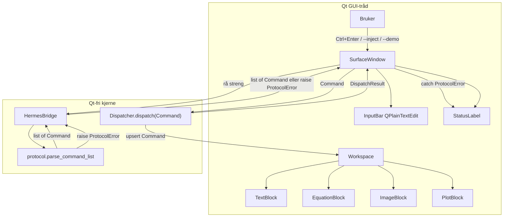

# Surface v0.1 — teknisk designdokument

| Felt | Verdi |
|---|---|
| **Tittel** | Surface v0.1 — implementerbart engineering-design |
| **Forfatter** | TBD |
| **Dato** | 2026-09-03 |
| **Status** | Draft |
| **Kilde** | `C:\PROJECTS\surface_test\plan.md` |
| **Kodebase** | Greenfield. Eneste fil i repoet er `plan.md`. Ingen pakke, tester eller UI-kode eksisterer ennå. |

Dette dokumentet er *ikke* en omskriving av `plan.md`. Det er det konkrete engineering-designet som gjør v0.1 implementerbart uten videre oppfinnelse i hver PR. Produktmål, scope og filnavn kommer fra `plan.md`. Valg som `plan.md` lar stå åpne (biblioteker, skjema, vindusatferd, Hermes-antakelse, feilmodell) er tatt her.

---

## Overview

Surface v0.1 er en lokal, borderless PySide6-arbeidsflate som viser fire representasjoner — tekst/markdown, LaTeX-ligning, bilde og plot — drevet av et lite JSON-kommandoformat. Hermes og andre fremtidige produsenter eier *ikke* UI-presentasjonen; de sender strukturerte kommandoer. Surface validerer, ruter og renderer.

Repoet er tomt utover `plan.md`. v0.1 skal derfor bootstrappe en `src/`-pakke, et native Windows-vindu, en Qt-fri protokoll+dispatcher, fire block-widgets, en tynn Hermes-adapter, og pytest for protokoll og dispatcher. Ikke-mål (minne, knowledge graph, plugins, 3D, voice, persistens, kompleks layout, ferdig visuell design) er harde grenser.

---

## Background & Motivation

`plan.md` definerer en prototype for en studie-arbeidsflate. Dagens tilstand er null kode. Uten et opinionated design vil hver PR måtte finne opp:

- kommando-skjema for `image` og `plot` (kun `equation` er eksemplifisert i planen)
- om upsert-by-id er create, replace eller feil
- hvordan borderless oppfører seg på Windows
- hvilken LaTeX- og plot-renderer som skal inn
- hva «Hermes-bro» betyr når Hermes ikke finnes i repoet

Smertene dette designet fjerner: AI-laget skal ikke sende ferdig HTML/widget-trær; protocol er kontrakten. Feil skal være kontrollerte (ingen Qt-krasj). Testdekning skal kunne kjøre uten display/GUI.

---

## Goals & Non-Goals

### Goals (v0.1 Definition of Done)

- Applikasjonen starter som et borderless PySide6-vindu på Windows.
- Workspace kan vise tekst, én LaTeX-ligning, et bilde og et plot.
- Alle fire representasjoner opprettes gjennom samme strukturerte protocol.
- Hermes kan sende minst én gyldig kommando gjennom `hermes_bridge.py` og få den rendret (via stub/adapter + `--inject` / `--demo`; se Hermes-antakelse).
- Ugyldige kommandoer avvises kontrollert uten at applikasjonen krasjer.
- Protocol og dispatcher har automatiserte tester (pytest, uten Qt).
- Prototypen kan brukes i én ekte studieøkt.
- Ingen features utenfor v0.1-scope.

### Non-goals (eksplisitt utelatt)

Memory-system, knowledge graph, learning-loop/mastery, 3D, voice, multi-agent, plugins/MCP, kompleks layoutmotor, ferdig visuell design, persistente workspaces, HTTP-klient, streaming LLM-protokoll, vilkårlig matplotlib-kode fra AI, automatiserte GUI-tester (QTest/pytest-qt), sletting av blocks i UI, mørk tema, runde hjørner/transparens, internasjonalisering-rammeverk.

Tillatte filer utover `plan.md`-treet, med begrunnelse:

| Fil | Hvorfor |
|---|---|
| `src/surface/__main__.py` | Nødvendig for `python -m surface`. |
| `.gitignore` | Nødvendig for et Python-prosjekt (`__pycache__`, `.venv`, `*.egg-info`). |
| `src/surface/image_source.py` | Qt-fri bildesti-policy (UNC/URL/suffiks) slik at sikkerhetsgrensen kan testes uten Qt. `parse_command` sjekker ikke fil-eksistens. |

Ingen `README.md`, ingen `demo.py`, ingen ekstra pakker.

---

## Key Decisions

1. **Python `>=3.11`, ikke `>=3.14`.** Maskinen har 3.14, men å kreve 3.14 blokkerer andre. 3.11 gir `list[str] | None` og er den laveste fornuftige linjen. 3.14 er støttet som øvre *testet* versjon, ikke som minimum.
2. **Dataclasses + eksplisitt validering, ikke Pydantic.** Fire kommando-typer. Validering blir ~100–150 linjer. Ingen ekstra runtime-avhengighet. Matcher «små, tydelige abstraheringer».
3. **Protocol er Qt-fri. Dispatcher er Qt-fri. `image_source.py` er Qt-fri.** `protocol.py`, `dispatcher.py`, `hermes_bridge.py` og `image_source.py` skal kunne importeres og testes uten PySide6. Kun `app.py`, `window.py`, `workspace.py` og `blocks/*` importerer Qt.
4. **Upsert-by-id.** Kommando med ny `id` oppretter block. Samme `id` + samme `type` erstatter innhold. Samme `id` + annen `type` → `type_mismatch` (ikke silent convert). Ingen `action`-felt i v0.1. Ingen `remove`-kommando i protocol (men `Workspace.remove` finnes for tester).
5. **Ukjente felter avvises (strict), også i nestede `series[]`-objekter.** Protocol skal være lite og eksplisitt. Å ignorere ukjente felter skjuler skjema-drift og er den faktiske `eval`-flaten for plot.
6. **Plot-data er strukturerte serier, aldri matplotlib-kode.** AI-laget får ikke `eval`/`exec`. `series[].x` / `series[].y` koerseres til `float` og må være finite. `bool`, `NaN` og `Infinity` avvises.
7. **Bilder: kun lokale filstier.** Ingen HTTP, ingen data-URI, ingen UNC (`\\server\...`). Prefiks/UNC/suffiks sjekkes *før* `stat`/`is_file`. Ingen workspace-root-sandbox: enhver lokal rasterfil prosessen kan lese er tillatt (path traversal er *ikke* mitigert). Mapped drive (`Z:\`) avvises ikke.
8. **Markdown: `QTextDocument.setMarkdown(..., MarkdownDialectGitHub | MarkdownNoHTML)`, ikke `QTextBrowser.setMarkdown`.** `QTextEdit.setMarkdown` tar bare strengen; flaggene lever på dokumentet. `MarkdownNoHTML` alene er CommonMark-minus-HTML og dropper GitHub-dialekten. Rå HTML i `content` strippes, ikke eksekveres. `format: "plain"` er slippventilen.
9. **LaTeX: matplotlib mathtext → `QPixmap`.** Allerede avhengig av matplotlib til plots. Ingen TeX-installasjon (MiKTeX). Begrenset LaTeX-subsett, dokumentert.
10. **Plots: matplotlib `FigureCanvasQTAgg`.** Én stack for ligning+plot. Ingen pyqtgraph. Ingen PNG-rundtur som primærvei. Bootstrap: `os.environ.setdefault("QT_API", "PySide6")` *før* matplotlib/Qt-import, deretter `matplotlib.use("QtAgg")`, deretter `from PySide6.QtWidgets import QApplication`. `FigureCanvasQTAgg` importeres *ikke* på modulnivå i `plot.py`.
11. **Hermes er ikke i repoet.** `HermesBridge` er en synkron `str → list[Command]`-adapter som *kan kaste* `ProtocolError`. Ingen LLM-klient, ingen subprocess, ingen streaming. DoD oppfylles med fixture-JSON gjennom broen (`--demo` / `--inject`).
12. **Brukerinput:** Ctrl+Enter i bunnliste. JSON-protokoll → parse (ignorerer `text_id`). Ellers → `TextCommand` med generert `id` (`user-N`, hopper over id-er som allerede finnes i workspace). Brukerinput går *ikke* til en ekte Hermes-prosess i v0.1. `content` lagres *stripped*.
13. **Feilmodell / pipeline (én kanonisk flyt):** Broen oversetter og parser (`str → list[Command]`, kan kaste `ProtocolError`). `Dispatcher.dispatch` tar en *allerede parset* `Command` og fanger `TypeMismatchError` / `UnknownBlockError` til `DispatchResult`. **Window er Qt-grensen** for *parse*-feil: den fanger `ProtocolError` fra broen. **`Block.render` kaster aldri** — `ProtocolError` fra `resolve_image_file`, mathtext-feil og matplotlib-feil fanges i widgeten og vises som fallback-UI; `dispatch` forblir `ok=True`. Ugyldig JSON fra inputbar blir `invalid_json` / `cannot_translate`, aldri `internal_error`. Uventede unntak i Window-flyten (ikke `ProtocolError`) blir `internal_error` via `try/except Exception` i `submit_text` / `inject_hermes_output` / `run_demo` / `apply_commands`.
14. **Window: `FramelessWindowHint` + egendefinert tittelrad + `startSystemMove` + `QSizeGrip`.** Ikke DWM-rundede hjørner, ikke `nativeEvent`/`WM_NCHITTEST` i v0.1 (mer kode, mer Windows-quirks).
15. **Layout: vertikal stack i `QScrollArea`.** Ikke chatbot-bobler, ikke fri posisjonering, ikke grid-motor. Scroll skjer i scroll-area, ikke inne i den enkelte block. Hver block rapporterer `sizeHint` (se størrelsesregler).
16. **Entry point:** både `python -m surface` og konsriptet `surface`. `run(argv) -> int` er den egentlige entryen; `main` gjør `raise SystemExit(run(argv))`.
17. **Tester: pytest uten Qt.** `FakeWorkspace` i `tests/test_dispatcher.py`. Ingen pytest-qt i v0.1. Visuell røyk: `python -m surface --demo`. Qt-frihet håndheves ved at kjernemodulene ikke importerer Qt (review), ikke ved en CI-test som feiler i et venv der PySide6 er installert.
18. **PR 3 låser fire-type-skjemaet.** `plan.md` sier «protocol med `text` først»; avviket er bevisst slik at block-PRs ikke reforhandler JSON. Rendererne tar igjen i PR 4–7. UI som kan lime inn vilkårlig JSON (inputbar, `--inject`) skal ikke merges før factory kjenner alle fire typene. `--demo` utvides per block-PR som manuell visningssti.
19. **`dispatch_many` er sekvensiell, ikke transaksjonell etter parse.** Parse-feil (skjer i broen/`parse_command_list`, *før* `dispatch_many`) → ingenting upsertes. Etter at listen er parset: kommandoer anvendes i rekkefølge; `type_mismatch` på #2 lar #1 bli stående. Statuslinjen: første feil vinner, ellers siste suksess (eller `{n} ok` når n>1 og alle ok).
20. **`--demo`-payload bygges som Python-dicts + `json.dumps`.** Ingen manuell sti-interpolasjon inn i JSON-strenger (Windows `\U` i temp-stier). PNG skrives *før* parse. `--demo` og `--inject` er gjensidig utelukkende og kjøres *etter* `show()`.
21. **Statuslinje ved suksess:** én kommando → `created {id} ({type})` eller `updated {id} ({type})`. Flere, alle ok → `{n} ok`. Tom/whitespace-submit endrer ikke statuslinjen.
22. **`Block.render` kaster aldri.** Fallback-UI i widgeten; første feilede render er likevel `created` med fallback (matcher `dispatch` `ok=True`). `Workspace.upsert` kaller `render` *før* `addWidget` / dict-insert, så et brudd på denne regelen (programmeringsfeil) ikke etterlater en halv-innsatt widget. Python-snuttene i Window/Block er kanoniske; mermaid er skisse.
23. **Open Questions 1–3 er bruker-låst til A (2026-09-03).** Ingen Hermes-transport, ingen sending av notater til Hermes, mathtext uten system-LaTeX/MathJax. Skal ikke gjenåpnes under v0.1-implementasjon.

---

## Proposed Design

### Arkitektur

Én kanonisk pipeline. Broen eier oversettelse/parse. Dispatcher eier upsert. Window eier Qt-grensen og statuslinjen.



Prinsippet fra `plan.md` bevares: Hermes uttrykker intensjon/data. Surface eier rendering.

Python-snuttene under (`submit_text`, `Block.render`, `Workspace.upsert`) er kanoniske. Mermaid er oversikt.

```mermaid
sequenceDiagram
  actor User
  participant Window as SurfaceWindow
  participant Bridge as HermesBridge
  participant Proto as protocol.py
  participant Disp as Dispatcher
  participant WS as Workspace
  participant Block as TextBlock/EquationBlock/...

  User->>Window: Ctrl+Enter (JSON eller notat)
  Window->>Bridge: from_user_input(text, text_id=user-N)
  alt ugyldig JSON / cannot_translate
    Bridge-->>Window: raise ProtocolError
    Window->>Window: statuslinje error_code: message
  else parse OK
    alt gyldig JSON-protokoll
      Bridge->>Proto: parse_command_list
      Proto-->>Bridge: list[Command]
      Note over Bridge: text_id ignoreres
    else fri tekst
      Bridge-->>Window: [TextCommand(id=user-N, content=stripped)]
    end
    Bridge-->>Window: list[Command]
    Window->>Disp: dispatch_many(commands)
    loop for hver Command
      Disp->>WS: upsert(command)
      alt ny id
        WS->>Block: create_block
        WS->>Block: render (kaster aldri; ev. fallback-UI)
        WS->>WS: addWidget + dict-insert
        WS-->>Disp: "created"
      else samme id og type
        WS->>Block: render (kaster aldri)
        WS-->>Disp: "updated"
      else samme id, annen type
        WS-->>Disp: TypeMismatchError
      else type uten factory
        WS-->>Disp: UnknownBlockError
      end
      Disp-->>Window: DispatchResult
    end
    Window->>Window: statuslinje fra N resultater
  end
```

Forventet last: én lokal bruker, typisk < 30 blocks per studieøkt. Ingen server. Latensmål (veiledende, ikke CI-gates): tekst < 50 ms, ligning < 200 ms, plot < 300 ms for ≤ 1000 punkter, bilde bundet av disk. Alt kjører på GUI-tråden.

### Prosjekt-bootstrap

#### Python-versjon

```toml
requires-python = ">=3.11"
```

**Begrunnelse:** 3.11 er bredt tilgjengelig og har syntaksen designet bruker (`X | Y`, `list[str]`). Maskinens 3.14 (`C:\Users\marcu\AppData\Local\Programs\Python\Python314\python.exe`) brukes til lokal kjøring, men skal ikke være minimum. Øvre grense pinses ikke.

**Risiko:** PySide6-hjul kan henge etter helt nye CPython-versjoner. Hvis 3.14 mangler hjul: bruk 3.12/3.13 til appen; protokollen/testene kan fortsatt kjøres på 3.14.

#### `pyproject.toml` (komplett innhold)

```toml
[build-system]
requires = ["setuptools>=68"]
build-backend = "setuptools.build_meta"

[project]
name = "surface"
version = "0.1.0"
description = "Borderless PySide6 workspace for text, equations, images, and plots."
requires-python = ">=3.11"
dependencies = [
    "PySide6>=6.6,<7",
    "matplotlib>=3.8",
]

[project.optional-dependencies]
dev = [
    "pytest>=8.0",
]

[project.scripts]
surface = "surface.app:main"

[tool.setuptools.package-dir]
"" = "src"

[tool.setuptools.packages.find]
where = ["src"]

[tool.pytest.ini_options]
testpaths = ["tests"]
```

Ingen `markdown`-pakke, ingen Pydantic, ingen pytest-qt, ingen ruff/mypy som påkrevd v0.1-verktøy.

#### Layout

```text
C:\PROJECTS\surface_test\
├── plan.md                 # urørt av implementasjonen inntil v0.2 planlegges
├── pyproject.toml
├── .gitignore
├── src\
│   └── surface\
│       ├── __init__.py
│       ├── __main__.py     # tillegg: python -m surface
│       ├── app.py
│       ├── window.py
│       ├── workspace.py
│       ├── protocol.py
│       ├── dispatcher.py
│       ├── hermes_bridge.py
│       ├── image_source.py # tillegg: Qt-fri bildesti-policy
│       └── blocks\
│           ├── __init__.py
│           ├── base.py
│           ├── text.py
│           ├── equation.py
│           ├── image.py
│           └── plot.py
└── tests\
    ├── test_protocol.py
    └── test_dispatcher.py
```

`.gitignore` skal minst inneholde:

```gitignore
.venv/
__pycache__/
*.py[cod]
*.egg-info/
.pytest_cache/
dist/
build/
```

#### Hvordan kjøre

```powershell
cd C:\PROJECTS\surface_test
py -3.14 -m venv .venv
.\.venv\Scripts\Activate.ps1
pip install -e ".[dev]"
python -m surface
python -m surface --demo
python -m surface --inject path\to\commands.json
pytest
surface --demo
```

`src/surface/__init__.py` eksporterer kun versjon og skal **ikke** importere PySide6:

```python
__version__ = "0.1.0"
```

`src/surface/__main__.py`:

```python
from surface.app import main

if __name__ == "__main__":
    main()
```

#### `run` / `main` og CLI

```python
# src/surface/app.py
def run(argv: list[str] | None = None) -> int:
    """CLI + event loop. argv er argumentene *uten* programnavn (som sys.argv[1:]).

    Returkoder:
        0 — event loop avsluttet normalt (vindu lukket).
        2 — CLI-bruksfeil: ukjente/ekstra posisjonelle args, både --demo og --inject,
            mangler PATH til --inject, --inject-fil finnes ikke / kan ikke leses.
            Skrives til stderr. Ingen QApplication, ingen vindu.
        1 — uventet feil før event loop (logges).
    """

def main(argv: list[str] | None = None) -> None:
    raise SystemExit(run(argv))
```

`run(None)` bruker `sys.argv[1:]`. argparse med `exit_on_error=False`; `ArgumentError` mappes til retur `2` (ikke `SystemExit` fra argparse). `--demo` og `--inject` i en mutually exclusive group. Ekstra posisjonelle argumenter er feil.

`run` rekkefølge ved suksess:

1. Parse argv. CLI-feil → `return 2`.
2. Hvis `--inject PATH`: les filen som UTF-8 med BOM (`utf-8-sig`). `OSError` / ikke-fil → stderr + `return 2`. Innholdet holdes i minnet.
3. Matplotlib/Qt-bootstrap (se under).
4. `QApplication`, `SurfaceWindow`, `win.show()`.
5. Hvis `--demo`: `win.run_demo()` (skriver PNG, `json.dumps`, bro + `dispatch_many`).
6. Elif `--inject`: `win.inject_hermes_output(already_read_text)`.
7. `return app.exec()`.

Protokollfeil i steg 5–6 vises på statuslinjen (vinduet er allerede synlig). Filfeil skjer i steg 2 uten vindu.

CLI-flagg:

| Flagg | Når kjøres | Effekt |
|---|---|---|
| *(ingen)* | — | Tom workspace, vindu + inputbar (inputbar fra PR 8). |
| `--demo` | **etter** `show()` | Skriver temp-PNG, `HermesBridge.demo_output(image_source=...)` via `json.dumps`, `from_hermes_output` + `dispatch_many`. Én av hver command-type. |
| `--inject PATH` | **etter** `show()` | Allerede innlest streng → `from_hermes_output` + `dispatch_many`. |

`--demo` og `--inject` sammen → CLI-feil, exit 2, ingen vindu.

`--demo` og `--inject` er operator-stier, ikke produktfeatures. De oppfyller DoD og visuell røyk uten å bygge plugin-system.

#### Matplotlib / Qt-binding bootstrap

matplotlibs Qt-backend velger binding i rekkefølgen: allerede importert binding, ellers `QT_API`, ellers **PyQt6, PySide6, PyQt5, PySide2**. `matplotlib.use("QtAgg")` *før* PySide6 er importert vil binde PyQt6 hvis den finnes — deretter krasjer blandede bindinger.

Kanonisk prefiks, **første kjørbare linjer** i `run()` etter CLI-parse, og det eneste stedet som får lov å sette backend:

```python
import os
os.environ.setdefault("QT_API", "PySide6")
import matplotlib
matplotlib.use("QtAgg")
from PySide6.QtWidgets import QApplication
from surface.window import SurfaceWindow
```

Regler:

- Ingen annen modul skal importere `matplotlib.backends.backend_qtagg` på *modulnivå*.
- `plot.py` importerer `FigureCanvasQTAgg` inne i `PlotBlock.__init__` (etter at `app.py` har satt backend).
- `equation.py` bruker `matplotlib.mathtext.math_to_image` (Agg internt) og skal **ikke** importere Qt-backenden.
- Ingen modul bruker `matplotlib.pyplot`.
- Protocol/dispatcher/hermes/image_source forblir Qt- og canvas-frie.
- Tester som ikke importerer `blocks`/`window`/`app` påvirkes ikke.

### PySide6-vindu (Windows)

`SurfaceWindow` er en `QWidget` (ikke `QMainWindow` — vi vil ikke ha default menylinje/dock-chrome).

```python
class SurfaceWindow(QWidget):
    def __init__(self) -> None: ...
    def submit_text(self, text: str) -> None: ...
    def run_demo(self) -> None: ...
    def inject_hermes_output(self, raw: str) -> None: ...
    def apply_commands(self, commands: list[Command]) -> None: ...
```

Kanonisk Window-flyt (alle stier, inkl. `--demo` / `--inject` / inputbar):

```python
def submit_text(self, text: str) -> None:
    if not text.strip():
        return
    try:
        commands = self._bridge.from_user_input(
            text, text_id=self._allocate_user_id()
        )
        self.apply_commands(commands)
    except ProtocolError as exc:
        self._set_status_error(exc)
    except Exception as exc:
        self._set_internal_error(exc)

def inject_hermes_output(self, raw: str) -> None:
    try:
        commands = self._bridge.from_hermes_output(raw)
        self.apply_commands(commands)
    except ProtocolError as exc:
        self._set_status_error(exc)
    except Exception as exc:
        self._set_internal_error(exc)

def run_demo(self) -> None:
    try:
        path = self._write_demo_png()
        raw = self._bridge.demo_output(image_source=str(path))
        self.inject_hermes_output(raw)
    except Exception as exc:
        self._set_internal_error(exc)

def apply_commands(self, commands: list[Command]) -> None:
    try:
        results = self._dispatcher.dispatch_many(commands)
        self._set_status_from_results(results)
    except Exception as exc:
        self._set_internal_error(exc)

def _set_status_error(self, exc: ProtocolError) -> None:
    self._status.setText(f"{exc.code}: {exc.message}")
    logging.getLogger("surface").warning("%s %s", exc.code, exc.command_id)

def _set_internal_error(self, exc: BaseException) -> None:
    logging.getLogger("surface").exception("internal_error")
    self._status.setText(f"internal_error: {type(exc).__name__}")

def _set_status_from_results(self, results: list[DispatchResult]) -> None:
    if not results:
        return
    first_err = next((r for r in results if not r.ok), None)
    if first_err is not None:
        self._status.setText(f"{first_err.error_code}: {first_err.error_message}")
        return
    if len(results) == 1:
        r = results[0]
        self._status.setText(f"{r.action} {r.command_id} ({r.command_type})")
        return
    self._status.setText(f"{len(results)} ok")
```

`_allocate_user_id`: teller fra 1; hopp over id-er som allerede finnes i `workspace.list_ids()` (`user-1` opptatt → `user-2`). `text_id` sendes alltid inn, men `from_user_input` **bruker den bare** når payload ikke er JSON-protokoll.

`ProtocolError` fra broen er forventet og treffer `_set_status_error`. Render-feil skal *ikke* komme hit: `Block.render` svelger dem. `internal_error` er kun for programmeringsfeil som likevel lekker (f.eks. brudd på never-raises). Nested `try` i `run_demo` → `inject_hermes_output` er bevisst; ytterste catch i `run_demo` dekker PNG-skriving.

**Flagg:**

```python
self.setWindowFlags(Qt.FramelessWindowHint | Qt.Window)
```

Ikke `WA_TranslucentBackground`. Ikke runde hjørner. Ikke always-on-top. Standard Qt-palett, vindu-bakgrunn `#F5F5F5` er tillatt som én linje — ikke et designsystem.

**Størrelse:** default 960×720, minimum 640×480, sentrert på skjermen ved første visning.

**Tittelrad (32 px):** venstre: tekst `Surface`. Høyre: Minimér (`showMinimized`) og Lukk (`close`). Ingen maksimer-knapp i v0.1 (kan fortsatt Windows-resize via size grip). Tittelraden kaller `self.windowHandle().startSystemMove()` på venstre museknapp — Qt 6-API som fungerer på Windows 10/11.

**Resize:** `QSizeGrip` nederst til høyre. Bevisst *ikke* `nativeEvent`/`WM_NCHITTEST` i v0.1. Kjente begrensninger: ingen kant-resize rundt hele rammen, begrenset Aero Snap. Akseptabelt for prototype.

**Lukking:** Alt+F4 og Lukk-knappen. Esc lukker *ikke*. Ingen unsaved-dialog (ingen persistens).

**Layout inne i vinduet, topp til bunn:**

```text
[ TitleBar: "Surface"              [_][X] ]
[ QScrollArea → Workspace (vertikal stack) ]
[ StatusLabel (én linje, 11pt)             ]
[ InputBar: QPlainTextEdit + "Send"-knapp  ]
[ QSizeGrip i hjørnet                      ]
```

Dette er en arbeidsflate + kommandolinje, **ikke** chatbot-layout: ingen bobler, ingen avatarer, ingen «assistant/user»-roller, ingen timestamps.

**Brukerinput:**

- Widget: `QPlainTextEdit`, ca. 72 px høy, placeholder: `Notat eller JSON-kommando. Ctrl+Enter sender.`
- Submit: Ctrl+Enter, eller `Send`-knapp.
- Enter alene = ny linje (nødvendig for å lime inn pretty-printed JSON).
- Tom/whitespace-only submit ignoreres (ingen feil, statuslinje uendret).
- JSON-deteksjon (i broen): strippet tekst starter med `{` eller `[`. Da er det protokoll, ikke notat. Ugyldig JSON → `ProtocolError` fanget i Window → statuslinje, ingen text-block.

**Feil i UI:** statuslinje viser `error_code: error_message` (eller suksessformatet over). Ingen modal dialog, ingen crash, ingen ErrorBlock (det ville vært en femte representasjon). Forrige vellykkede blocks blir stående, inkludert ved delvis `dispatch_many`.

### Protocol-skjema

Alle kommandoer er JSON-objekter. Felles konvolutt:

| Felt | Påkrevd | Type | Regler |
|---|---|---|---|
| `type` | ja | string | nøyaktig én av `text`, `equation`, `image`, `plot` |
| `id` | ja | string | `^[A-Za-z0-9][A-Za-z0-9._-]{0,63}$` (1–64 tegn, ASCII) |

Ingen `schema_version`, ingen `action`, ingen `timestamp`. Nye felter i konvolutten legges kun til ved konkret behov.

Ukjent `type` → `unknown_type`. Ukjent felt på objektet **eller** på et `series[]`-element → `unknown_field`. Manglende påkrevd felt → `missing_field`. Feil Python/JSON-type for et kjent felt → `invalid_field`.

Batch: Hermes kan sende én kommando, en JSON-liste, eller `{"commands": [ ... ]}`. Det finnes **ikke** et felles wrapper-felt utover `commands` (som kun er lov når `type` *ikke* er satt — `commands` er batch-konvolutt, ikke en command-type).

**Lagring vs. validering av strenger:** `content`, `latex`, `source`, `alt`, `title`, `xlabel`, `ylabel`, `label` strippes for tomhet/lengde. **Lagret verdi er den strippede strengen.** (JSON-dekodet verdi med leading/trailing whitespace blir altså trimmet.)

#### `text`

```json
{
  "type": "text",
  "id": "t-1",
  "content": "## Bjelketeori\nBøyespanning dekkes av equation-block.",
  "format": "markdown"
}
```

| Felt | Påkrevd | Default | Regler |
|---|---|---|---|
| `content` | ja | — | string; etter strip lengde 1–50_000. Tom/whitespace avvises. Lagres stripped. |
| `format` | nei | `"markdown"` | `"markdown"` eller `"plain"` |

**Markdown-subsett (`MarkdownDialectGitHub | MarkdownNoHTML` på `QTextDocument`):**

Tillatt: `#` `##` `###` headings, `**bold**`, `*italic*`, `` `inline code` ``, fenced code blocks, uordnet/ordnet liste, enkle lenker (vises, **ingen navigasjon**).

Ikke støttet: rå HTML (strippes av `MarkdownNoHTML`, eksekveres ikke), bilder i markdown (``), tabeller, footnotes. Bilder er `image`-kommandoen. Inline `$...$` i markdown rendres **ikke** som matematikk (det er `equation`-blockens jobb). Qt kan vise dollar-tegn som tekst.

Kanonisk render:

```python
from PySide6.QtGui import QTextDocument

browser.setReadOnly(True)
browser.setOpenLinks(False)
browser.setOpenExternalLinks(False)
browser.setVerticalScrollBarPolicy(Qt.ScrollBarAlwaysOff)
browser.setHorizontalScrollBarPolicy(Qt.ScrollBarAlwaysOff)
if command.format == "plain":
    browser.setPlainText(command.content)
else:
    browser.document().setMarkdown(
        command.content,
        QTextDocument.MarkdownFeature.MarkdownDialectGitHub
        | QTextDocument.MarkdownFeature.MarkdownNoHTML,
    )
```

#### `equation`

```json
{
  "type": "equation",
  "id": "eq-1",
  "latex": "\\sigma = \\frac{My}{I}",
  "display": "block"
}
```

| Felt | Påkrevd | Default | Regler |
|---|---|---|---|
| `latex` | ja | — | string, etter strip 1–5_000 tegn, **uten** `$`-delimiters. Inneholder `$` → `invalid_field`. Lagres stripped. |
| `display` | nei | `"block"` | `"block"` eller `"inline"` |

Renderer wrapper `$<latex>$` (inline) eller bruker `\displaystyle` i `$...$` (block). mathtext-subsett, ikke full LaTeX (ingen `\begin{align}`, begrenset `\usepackage`). Ugyldig mathtext fanges i `EquationBlock.render` (kaster aldri), ikke i protocol (protocol sjekker form, ikke om uttrykket parser).

#### `image`

```json
{
  "type": "image",
  "id": "img-1",
  "source": "C:\\\\course\\\\beam.png",
  "alt": "Bjelke tverrsnitt"
}
```

| Felt | Påkrevd | Default | Regler |
|---|---|---|---|
| `source` | ja | — | ikke-tom string etter strip. `parse_command` sjekker **ikke** at filen finnes og **ikke** stien-policy (holder schema-tester fil-frie). Lagres stripped. |
| `alt` | nei | `""` | string, max 500 tegn etter strip |

Sti-policy ligger i `surface.image_source` og kalles fra `ImageBlock.render`, ikke fra `parse_command`. `resolve_image_file` **kaster** `ProtocolError`; `ImageBlock.render` **fanger den** og viser fallback. Da kan `--inject` av manglende fil fortsatt opprette en block (`dispatch` `ok=True`); blocken viser `alt` + feiltekst. Demo-sjekklisten krever at bilde-*widgeten* er synlig, ikke at pixmap lastet — men `--demo` skriver PNG *før* parse slik at lastingen faktisk skal lykkes.

Kanonisk `ImageBlock.render` (kaster aldri):

```python
def render(self, command: Command) -> None:
    if not isinstance(command, ImageCommand):
        self._show_fallback("", "image render failed: TypeError")
        return
    try:
        path = resolve_image_file(command.source)
        pixmap = QPixmap(str(path))
        if pixmap.isNull():
            self._show_fallback(command.alt, "unreadable image")
            return
        self._label.setPixmap(self._scaled(pixmap))
        self._label.setText("")
    except ProtocolError as exc:
        self._show_fallback(command.alt, f"{exc.code}: {exc.message}")
    except Exception as exc:
        self._show_fallback(command.alt, f"image render failed: {type(exc).__name__}")

def _show_fallback(self, alt: str, error: str) -> None:
    text = alt.strip() or "(image)"
    self._label.setPixmap(QPixmap())
    self._label.setText(f"{text}\n{error}")
```

**Sjekk-rekkefølge i `interpret_image_source` (ingen filesystem-I/O):**

1. Ikke-streng / tom etter strip → `empty_field`.
2. Case-insensitive prefiks `http://`, `https://`, `data:`, `file:` → `invalid_field`.
3. UNC: strippet verdi starter med `\\` eller `//` → `invalid_field`. Dette skjer **før** `Path.is_file()` / `stat`.
4. Suffiks i `{.png, .jpg, .jpeg, .gif, .bmp, .webp}` (case-insensitive) — ellers `invalid_field`.
5. Returner `pathlib.Path(stripped)` uten å røre disken.

**`resolve_image_file` (I/O, kalles i render):**

1. `path = interpret_image_source(source)`.
2. Relativ sti løses mot `Path.cwd()`.
3. `is_file()` — nei → `invalid_field` («not a file»).
4. `stat().st_size` > 20 MiB → `limit_exceeded`.
5. Returner resolved `Path`.

Mapped network drives (`Z:\share\a.png`) avvises **ikke**. Residual hang-risiko på GUI-tråden aksepteres i v0.1; UNC-prefiks er det vi faktisk stenger.

**Ikke sandbox:** path traversal (`..\..\..\Windows\...`) og absolute stier utenfor prosjektet er tillatt hvis filen er en lokal rasterfil prosessen kan lese. Dette er en lokal visningsapp, ikke et opplastingsfilter. Security-tabellen skal ikke påstå at traversal er mitigert.

Lastes med `QPixmap`. Animerte GIF: første frame, ikke `QMovie`.

#### `plot`

```json
{
  "type": "plot",
  "id": "plot-1",
  "title": "Moment langs bjelke",
  "xlabel": "x [m]",
  "ylabel": "M [Nm]",
  "series": [
    {
      "label": "lasttilfelle A",
      "kind": "line",
      "x": [0, 1, 2, 3],
      "y": [0, 12.5, 12.5, 0]
    }
  ]
}
```

| Felt | Påkrevd | Default | Regler |
|---|---|---|---|
| `series` | ja | — | liste, lengde 1–8 |
| `title` | nei | `""` | string ≤ 200 etter strip |
| `xlabel` | nei | `""` | string ≤ 100 etter strip |
| `ylabel` | nei | `""` | string ≤ 100 etter strip |

Hver serie (strict unknown keys — `"color"`, `"code"`, `"matplotlib_rc"` → `unknown_field`):

| Felt | Påkrevd | Default | Regler |
|---|---|---|---|
| `x` | ja | — | liste av number, lengde 1–10_000 |
| `y` | ja | — | samme lengde som `x` |
| `label` | nei | `""` | string ≤ 80 etter strip |
| `kind` | nei | `"line"` | `"line"` \| `"scatter"` \| `"bar"` |

Tallregler:

- JSON `number` aksepteres. Koerseres til `float` (`1` → `1.0`). `Series.x` / `Series.y` er `tuple[float, ...]`.
- `bool` avvises (`True` er `int`-subklasse i Python) → `invalid_field`.
- `null` og strenger avvises → `invalid_field`.
- Ikke-finite verdier (`NaN`, `Infinity`, `-Infinity`) avvises → `invalid_field`. Python `json.loads` tillater `NaN`/`Infinity` som standard; sjekk `math.isfinite` etter koersering.
- Ingen nested style-objekter. Autoskalering; ingen `xlim`/`ylim` i v0.1.

#### Valideringspolicy (samlet)

| Situasjon | Kode | Resultat |
|---|---|---|
| Ikke UTF-8 / ikke JSON | `invalid_json` | avvis |
| Rotverdi verken object eller (for list-parse) array | `not_object` | avvis |
| `type` ukjent | `unknown_type` | avvis |
| Extra JSON-nøkkel (toppnivå *eller* `series[]`) | `unknown_field` | avvis |
| Påkrevd nøkkel mangler | `missing_field` | avvis |
| Feil type / regex / `$` i latex / bool / NaN / Inf | `invalid_field` | avvis |
| Tom `content`/`latex`/`source`/`series` | `empty_field` | avvis |
| `id` matcher ikke regex | `invalid_id` | avvis |
| `series` > 8, punkter > 10_000, tekst > max, bilde > 20 MiB | `limit_exceeded` | avvis |
| Hermes-output ikke oversettbar | `cannot_translate` | avvis |
| Upsert med annen `type` | `type_mismatch` | avvis (dispatcher) |
| Command-type uten registrert block | `unknown_block` | avvis (dispatcher) |

`id` i feilobjektet settes når den lot seg lese, ellers `None`.

#### Idempotens

`Workspace` holder `dict[str, Block]` og `dict[str, Command]` nøklet på `id`.

- Ny `id` → `created` (også når første `render` viser fallback-UI).
- Eksisterende `id`, samme `type` → `block.render(command)` og erstatt lagret Command → `updated`. Full replace av payload, ikke felt-merge. `render` kaster aldri, så workspace-dicts oppdateres etter vellykket (fallback-inkluderende) return.
- Eksisterende `id`, annen `type` → `TypeMismatchError`. Workspace uendret for *den* id-en.
- Type uten factory → `UnknownBlockError`. Workspace uendret for den id-en.

To identiske kommandoer etter hverandre er lov og gir `updated` andre gang (idempotent visning).

#### `dispatch_many`-atomisitet

| Fase | Feil | Mutasjon |
|---|---|---|
| `parse_command_list` / bro (før upsert) | første ugyldige element, fail-fast | **ingen** upsert |
| `dispatch_many` på allerede parset liste | `type_mismatch` / `unknown_block` på kommando *i* | kommandoer `0..i-1` er allerede upsertet; *i* hoppes over; **resten av listen kjøres videre** |

Statuslinjen viser første `ok=False`, ellers suksessformatet. `--inject` av fire kommandoer der #2 har type-kollisjon kan altså vise #1, #3, #4 plus feil på statuslinjen. Dette er bevisst (A), ikke en skjult transaksjon.

### Python-typer og signaturer

Alt under er kanonisk. Implementasjonen skal matche.

```python
# src/surface/protocol.py
# Qt-free by design.
from __future__ import annotations

from dataclasses import dataclass
from typing import Any, Literal, Union

CommandType = Literal["text", "equation", "image", "plot"]
TextFormat = Literal["markdown", "plain"]
EquationDisplay = Literal["block", "inline"]
SeriesKind = Literal["line", "scatter", "bar"]

MAX_ID_LENGTH = 64
MAX_TEXT_LENGTH = 50_000
MAX_LATEX_LENGTH = 5_000
MAX_ALT_LENGTH = 500
MAX_SERIES = 8
MAX_POINTS = 10_000
ID_PATTERN = r"^[A-Za-z0-9][A-Za-z0-9._-]{0,63}$"

class ProtocolError(Exception):
    def __init__(
        self,
        code: str,
        message: str,
        *,
        command_id: str | None = None,
    ) -> None:
        super().__init__(message)
        self.code = code
        self.message = message
        self.command_id = command_id

@dataclass(frozen=True)
class TextCommand:
    type: Literal["text"]
    id: str
    content: str
    format: TextFormat = "markdown"

@dataclass(frozen=True)
class EquationCommand:
    type: Literal["equation"]
    id: str
    latex: str
    display: EquationDisplay = "block"

@dataclass(frozen=True)
class ImageCommand:
    type: Literal["image"]
    id: str
    source: str
    alt: str = ""

@dataclass(frozen=True)
class Series:
    x: tuple[float, ...]
    y: tuple[float, ...]
    label: str = ""
    kind: SeriesKind = "line"

@dataclass(frozen=True)
class PlotCommand:
    type: Literal["plot"]
    id: str
    series: tuple[Series, ...]
    title: str = ""
    xlabel: str = ""
    ylabel: str = ""

Command = Union[TextCommand, EquationCommand, ImageCommand, PlotCommand]

def parse_command(payload: str | bytes | dict[str, Any]) -> Command:
    """Parse exactly one command object.

    Raises:
        ProtocolError: invalid JSON, unknown type/field, failed validation.
    """

def parse_command_list(payload: str | bytes | list[Any] | dict[str, Any]) -> list[Command]:
    """Parse one command, a JSON array of commands, or ``{"commands": [...]}``.

    Raises:
        ProtocolError: on the first invalid element (fail-fast, ingen delvis liste).
    """
```

`dict` inn i `parse_command` er allerede-deserialisert JSON (nyttig i tester). `bytes` dekodes som UTF-8 med BOM-stripping (`utf-8-sig`).

```python
# src/surface/image_source.py
# Qt-free by design.
from pathlib import Path

from surface.protocol import ProtocolError

ALLOWED_IMAGE_SUFFIXES = {".png", ".jpg", ".jpeg", ".gif", ".bmp", ".webp"}
MAX_IMAGE_BYTES = 20 * 1024 * 1024

def interpret_image_source(source: str) -> Path:
    """Prefiks, UNC, suffiks. Ingen filesystem-I/O.

    Raises:
        ProtocolError: empty_field | invalid_field
    """

def resolve_image_file(source: str) -> Path:
    """interpret_image_source + cwd-resolve + is_file + størrelse.

    Raises:
        ProtocolError: som over, plus not-a-file / limit_exceeded
    """
```

```python
# src/surface/dispatcher.py
# Qt-free by design.
from __future__ import annotations

from dataclasses import dataclass
from typing import Literal, Protocol as TypingProtocol

from surface.protocol import Command

class TypeMismatchError(Exception):
    def __init__(self, command_id: str, existing_type: str, new_type: str) -> None:
        self.command_id = command_id
        self.existing_type = existing_type
        self.new_type = new_type
        super().__init__(
            f"id {command_id!r} is {existing_type}, got {new_type}"
        )

class UnknownBlockError(Exception):
    def __init__(self, command_id: str, command_type: str) -> None:
        self.command_id = command_id
        self.command_type = command_type
        super().__init__(f"no block registered for type {command_type!r}")

class WorkspaceLike(TypingProtocol):
    def upsert(self, command: Command) -> Literal["created", "updated"]: ...
    def get(self, command_id: str) -> Command | None: ...
    def remove(self, command_id: str) -> bool: ...
    def list_ids(self) -> list[str]: ...

@dataclass(frozen=True)
class DispatchResult:
    ok: bool
    action: Literal["created", "updated"] | None
    command_id: str | None
    command_type: str | None  # innkommende type; ved type_mismatch er dette new_type
    error_code: str | None
    error_message: str | None

class Dispatcher:
    def __init__(self, workspace: WorkspaceLike) -> None: ...

    def dispatch(self, command: Command) -> DispatchResult:
        """Upsert én allerede parset Command.

        Never raises ProtocolError, TypeMismatchError or UnknownBlockError.
        Render-feil skal ikke nå hit (`Block.render` kaster aldri).
        Unexpected exceptions propagate (programmeringsfeil).
        """

    def dispatch_many(self, commands: list[Command]) -> list[DispatchResult]:
        """Sekvensiell dispatch. Returnerer én DispatchResult per element.

        Parse er kallerens jobb (bro / tester kaller parse_command_list først).
        """
```

`dispatch` logikk:

```python
def dispatch(self, command: Command) -> DispatchResult:
    try:
        action = self._workspace.upsert(command)
        return DispatchResult(
            ok=True,
            action=action,
            command_id=command.id,
            command_type=command.type,
            error_code=None,
            error_message=None,
        )
    except TypeMismatchError as exc:
        return DispatchResult(
            False, None, exc.command_id, exc.new_type, "type_mismatch", str(exc)
        )
    except UnknownBlockError as exc:
        return DispatchResult(
            False, None, exc.command_id, exc.command_type, "unknown_block", str(exc)
        )

def dispatch_many(self, commands: list[Command]) -> list[DispatchResult]:
    return [self.dispatch(command) for command in commands]
```

`DispatchResult.command_type` ved `type_mismatch` er den *innkommende* (`new_type`), ikke den eksisterende. Det er bevisst: statuslinjen viser hva som ble avvist.

```python
# src/surface/workspace.py
from __future__ import annotations

from typing import Literal

from PySide6.QtWidgets import QWidget

from surface.protocol import Command

class Workspace(QWidget):
    def __init__(self, parent: QWidget | None = None) -> None: ...

    def upsert(self, command: Command) -> Literal["created", "updated"]: ...
    def get(self, command_id: str) -> Command | None: ...
    def remove(self, command_id: str) -> bool: ...
    def list_ids(self) -> list[str]: ...
```

`upsert` rekkefølge (ingen halv-innsatt widget):

```python
def upsert(self, command: Command) -> Literal["created", "updated"]:
    existing = self._blocks.get(command.id)
    if existing is None:
        block = create_block(command, parent=self)  # UnknownBlockError før mutasjon
        block.render(command)  # kaster aldri; kan vise fallback
        self._layout.addWidget(block)
        self._blocks[command.id] = block
        self._commands[command.id] = command
        return "created"
    if existing.command_type() != command.type:
        raise TypeMismatchError(command.id, existing.command_type(), command.type)
    existing.render(command)  # kaster aldri
    self._commands[command.id] = command
    return "updated"
```

Ukjent type → `UnknownBlockError` (ikke en rå `KeyError`) *før* layout/dicts endres. Første render med fallback er likevel `created`. `remove` fjerner widget fra layout og sletter dict-oppføringer; returnerer `False` hvis `id` mangler. Ingen UI-knapp kaller `remove` i v0.1.

```python
# src/surface/blocks/base.py
from __future__ import annotations

from PySide6.QtWidgets import QWidget

from surface.protocol import Command

class Block(QWidget):
    def __init__(self, command_id: str, parent: QWidget | None = None) -> None:
        super().__init__(parent)
        self._command_id = command_id

    @property
    def command_id(self) -> str:
        return self._command_id

    def command_type(self) -> str:
        raise NotImplementedError

    def render(self, command: Command) -> None:
        """Oppdater widget fra command. Kalles ved create og upsert.

        Hard regel: kaster aldri. Fang ProtocolError, mathtext- og
        matplotlib-feil; vis fallback-tekst i widgeten og returner.
        """
        raise NotImplementedError
```

```python
# src/surface/blocks/__init__.py
from PySide6.QtWidgets import QWidget

from surface.blocks.base import Block
from surface.dispatcher import UnknownBlockError
from surface.protocol import Command

def create_block(command: Command, parent: QWidget | None = None) -> Block:
    """Factory. Mapper command.type → konkret Block-subklasse.

    Raises:
        UnknownBlockError: type ikke i _FACTORIES.
    """
```

`_FACTORIES` vokser med PR 4–7. Etter PR 7:

```python
_FACTORIES = {
    "text": TextBlock,
    "equation": EquationBlock,
    "image": ImageBlock,
    "plot": PlotBlock,
}
```

Ingen plugin-registrering utover denne dicten.

```python
# src/surface/hermes_bridge.py
# Qt-free by design.
from __future__ import annotations

from surface.protocol import Command, ProtocolError, parse_command_list, TextCommand

class HermesBridge:
    def from_hermes_output(self, output: str) -> list[Command]:
        """Oversett ekstern Hermes-streng til kommandoer.

        Strip, deretter parse_command_list.
        Strippet tekst som ikke starter med '{' eller '[' → ProtocolError(cannot_translate).
        Ugyldig JSON / ugyldig skjema → ProtocolError fra parseren (invalid_json, ...).
        """

    def from_user_input(self, text: str, *, text_id: str) -> list[Command]:
        """Brukerens inputbar.

        Strippet tekst som starter med '{' eller '[' → from_hermes_output
        (text_id ignoreres; kommandoene bærer sine egne id-er).
        Ellers → [TextCommand(type="text", id=text_id, content=text.strip(), format="markdown")].
        """

    @staticmethod
    def demo_output(*, image_source: str) -> str:
        """json.dumps av [text, equation, image, plot]. image_source er en
        allerede eksisterende filsti; json.dumps eskapér backslash på Windows.
        """
```

`demo_output` bygges som Python-lister/dicts, aldri via f-string inn i JSON:

```python
@staticmethod
def demo_output(*, image_source: str) -> str:
    payload = [
        {"type": "text", "id": "demo-text", "content": "## Surface demo", "format": "markdown"},
        {"type": "equation", "id": "demo-eq", "latex": r"\sigma = \frac{My}{I}"},
        {"type": "image", "id": "demo-img", "source": image_source, "alt": "demo"},
        {
            "type": "plot",
            "id": "demo-plot",
            "title": "demo",
            "series": [{"x": [0, 1, 2], "y": [0, 1, 0], "kind": "line"}],
        },
    ]
    return json.dumps(payload)
```

`SurfaceWindow.run_demo`:

1. Skriv en 64×64 PNG til `tempfile.gettempdir() / "surface-demo.png"`.
2. `raw = HermesBridge.demo_output(image_source=str(path))`.
3. `self.inject_hermes_output(raw)`.

PNG eksisterer før parse, så `ImageBlock.render` skal lykkes. Ingen binære fixtures sjekkes inn.

### Rendering-biblioteker

| Representasjon | Valg | Hvorfor | Ikke valgt |
|---|---|---|---|
| Markdown | `QTextDocument.setMarkdown(..., MarkdownDialectGitHub \| MarkdownNoHTML)` | Null ekstra dep; flaggene finnes på dokumentet, ikke på `QTextBrowser.setMarkdown`. `NoHTML` alene dropper GitHub-dialekten. | `markdown` / `markdown-it-py`. `QTextBrowser.setMarkdown(str)` (mister flags). |
| LaTeX | `matplotlib.mathtext.math_to_image` → `QPixmap` på `QLabel` | matplotlib er allerede inne for plot; ingen TeX-binær; synkront og lokalt. | MathJax+QWebEngine. `latex2mathml`. System-`latex`. |
| Bilde | `QPixmap` + `QLabel`, `KeepAspectRatio` + `SmoothTransformation` | Native Qt. | HTTP-fetch, `QMovie`, SVG. |
| Plot | `matplotlib.figure.Figure` + `FigureCanvasQTAgg` (lazy import) | Strukturerte serier plottes deterministisk; oppdatering = `figure.clear()` + redraw. | pyqtgraph. PNG-eksport som primærvei. Vilkårlig `exec`. |

**Equation-render (skisse):**

```python
from io import BytesIO
from matplotlib.mathtext import math_to_image
from PySide6.QtGui import QPixmap

def latex_to_pixmap(latex: str, *, display: str) -> QPixmap:
    inner = f"\\displaystyle {latex}" if display == "block" else latex
    buf = BytesIO()
    math_to_image(f"${inner}$", buf, dpi=144, format="png")
    pixmap = QPixmap()
    pixmap.loadFromData(buf.getvalue())
    return pixmap
```

Kanonisk `EquationBlock.render` (kaster aldri):

```python
def render(self, command: Command) -> None:
    if not isinstance(command, EquationCommand):
        self._label.setPixmap(QPixmap())
        self._label.setText("equation render failed: TypeError")
        return
    try:
        self._label.setPixmap(latex_to_pixmap(command.latex, display=command.display))
        self._label.setText("")
    except (ValueError, RuntimeError, Exception):
        self._label.setPixmap(QPixmap())
        self._label.setText(f"equation render failed: {command.latex}")
```

**Plot-render:** én `Figure` per `PlotBlock` (ikke global pyplot-state). `FigureCanvasQTAgg` importeres i `__init__`. Ved `kind=="bar"` brukes `ax.bar`. Legend kun hvis minst én serie har ikke-tom `label`. Matplotlib-feil fanges i `render` (kaster aldri):

```python
def render(self, command: Command) -> None:
    if not isinstance(command, PlotCommand):
        self._show_fallback("plot render failed: TypeError")
        return
    try:
        self._figure.clear()
        ax = self._figure.add_subplot(111)
        for series in command.series:
            if series.kind == "line":
                ax.plot(series.x, series.y, label=series.label or None)
            elif series.kind == "scatter":
                ax.scatter(series.x, series.y, label=series.label or None)
            else:
                ax.bar(series.x, series.y, label=series.label or None)
        if command.title:
            ax.set_title(command.title)
        if command.xlabel:
            ax.set_xlabel(command.xlabel)
        if command.ylabel:
            ax.set_ylabel(command.ylabel)
        if any(s.label for s in command.series):
            ax.legend()
        self._canvas.draw()
    except Exception as exc:
        self._show_fallback(f"plot render failed: {type(exc).__name__}")

def _show_fallback(self, message: str) -> None:
    try:
        self._figure.clear()
        ax = self._figure.add_subplot(111)
        ax.text(0.5, 0.5, message, ha="center", va="center", wrap=True)
        ax.set_axis_off()
        self._canvas.draw()
    except Exception:
        self._label.setText(message)  # QLabel-sibling, skjules når canvas lykkes
```

`TextBlock.render` wrapper `setMarkdown`/`setPlainText` i `try/except Exception` og faller tilbake til `setPlainText(command.content)` (eller `"(text render failed)"` hvis også det feiler).

**Threading:** matplotlib Qt-canvas og `QPixmap` kun på GUI-tråd. v0.1 har ingen worker-tråder. HermesBridge er synkron.

### Størrelsesregler (workspace + blocks)

`QScrollArea(widgetResizable=True)` tvinger barnet til viewport-bredde. Da *må* barnet rapportere en ærlig `sizeHint`-høyde; ellers spiser første `QTextBrowser` all høyde eller kollapser. Scroll skjer i `QScrollArea`, aldri inne i blocken.

Felles:

- Workspace: `QVBoxLayout`, alignment topp, spacing 12 px, padding 8 px, **ingen stretch** på slutt (`addStretch` er OK *nederst* slik at blocks pakkes mot toppen). `sizeHint` = layout size hint. Horisontal size policy Expanding, vertikal Minimum.
- Nye blocks append. Upsert beholder posisjon. Ingen drag-reorder.

| Block | Horisontal | Vertikal | Høyde | Bredde |
|---|---|---|---|---|
| `TextBlock` | Expanding | Maximum (ikke stretch) | `ceil(document.size().height())` + frame/margins. Koble `documentSizeChanged` → `updateGeometry()`. `ScrollBarAlwaysOff`. | Workspace content width |
| `EquationBlock` | Preferred | Maximum / Ignore stretch | Pixmap-høyde etter ev. nedskalering | Pixmap; hvis bredere enn workspace, skaler ned med `KeepAspectRatio` |
| `ImageBlock` | Expanding | Maximum | Etter skalering, **maks 480 px** | Skalert til workspace-bredde minus padding, `KeepAspectRatio` |
| `PlotBlock` | Expanding | Fixed | **320 px** | Workspace content width |

`widgetResizable=True` + disse `sizeHint`-ene gir en dokument-stack som scroller når summen overstiger viewport.

### Hermes-bro — antakelse og grenser

**Antakelse (kanonisk for v0.1):** Hermes er et *eksternt* system som ikke er i dette repoet og ikke har spesifisert transport. v0.1 modellerer Hermes som en produsent av **én UTF-8-streng**. Broen er `str → list[Command]` og kaster `ProtocolError` ved feil. Den returnerer ikke feil som en union-type.

DoD-setningen «Hermes kan sende minst én gyldig kommando gjennom `hermes_bridge.py` og få den rendret» oppfylles ved:

1. Enhetstest: `HermesBridge().from_hermes_output('{"type":"text","id":"h-1","content":"hei"}')` → `[TextCommand]`, deretter `Dispatcher.dispatch_many` mot `FakeWorkspace`.
2. Manuell sti: `python -m surface --inject file.json` eller `--demo`.

**Ikke i v0.1:** HTTP-server som lytter på Hermes, subprocess av en hermes-binær, streaming tokens, tool-calling, system prompts, API-nøkler, fil-watch.

Når ekte Hermes finnes, er integrasjonspunktet *kun* å levere strengen til `from_hermes_output` (f.eks. i v0.2). Surface-UI endres ikke.

`from_user_input` vs `from_hermes_output` er bevisst splittet: Hermes skal snakke protocol (prosa fra Hermes er `cannot_translate`, synlig på statuslinjen). Brukeren skal kunne ta notater uten JSON.

---

## API / Interface Changes

Greenfield — alt er nytt. Offentlig *pakke*-API holdes minimalt:

| Symbol | Modul | Offentlig? |
|---|---|---|
| `__version__` | `surface` | ja |
| `parse_command`, `parse_command_list`, `Command*`, `ProtocolError` | `surface.protocol` | ja (tester + bro) |
| `interpret_image_source`, `resolve_image_file` | `surface.image_source` | ja (tester) |
| `Dispatcher`, `DispatchResult` | `surface.dispatcher` | ja (tester) |
| `HermesBridge` | `surface.hermes_bridge` | ja |
| `main`, `run` | `surface.app` | ja (entry) |
| `SurfaceWindow`, `Workspace`, `Block` | respektive | interne, men importerbare |

Ingen stabilitetsløfte utenfor v0.1. Ingen HTTP API.

CLI er applikasjonens brukergrensesnitt utover vinduet: `surface`, `surface --demo`, `surface --inject PATH`.

---

## Data Model Changes

Ingen database. Ingen fil-persistens. Runtime-modell:

```text
Workspace
  _commands: dict[id, Command]    # siste gyldige payload per id
  _blocks:   dict[id, Block]      # QWidget-er
```

`Command` er immutable (`frozen=True`). Plot-serier lagres som `tuple[float, ...]` for å unngå mutasjon bak ryggen på blocks.

Ingen migrasjon. Prosessdød = tom workspace.

Grenser som indirekte er lagringsbudsjett: 8 serier × 10k punkter, 50k tegn tekst, 20 MiB bilder — tilstrekkelig for en studieøkt, bevisst lavt for å holde GUI-tråden responsiv.

---

## Alternatives Considered

### 1. Pydantic v2 vs dataclasses

| | Pydantic | Dataclasses (valgt) |
|---|---|---|
| Validering | Automatisk, gode feilmeldinger | Manuell, men skjemaet er lite |
| Dep | Extra runtime | Stdlib |
| Qt-frie tester | Ja | Ja |
| Overensstemmelse med prinsipper | Mer infrastruktur | Mindre |

Valgt dataclasses fordi protocol har fire tagged types og strenge unknown-field-regler som uansett må kodes eksplisitt (Pydantic default er ofte ignore/extra=forbid, men union-diskriminering + bool-i-series-fellen må håndteres manuelt likevel).

### 2. MathJax/WebEngine vs matplotlib mathtext (valgt)

WebEngine gir «ekte» LaTeX-utseende og `align`-miljøer, men trekker inn Qt WebEngine (~100 MB+), asynkron last, og CSS. mathtext er stygt for avansert LaTeX, men dekker ingeniørformler som `\frac{My}{I}` og krever null ny dep. Open Question 3 er bruker-låst til **A (2026-09-03)**: mathtext i v0.1. System-LaTeX/MathJax er v0.2 kun hvis en ekte studieøkt motbeviser mathtext.

### 3. pyqtgraph / PNG-rundtur vs FigureCanvasQTAgg (valgt)

pyqtgraph er raskere for interaktivt, men ny avhengighet og egen stil. PNG fra Agg er enklere widgets (`QLabel`) men dårligere upsert (re-encode) og blur ved DPI. `FigureCanvasQTAgg` er den naturlige matplotlib+Qt-veien og deler backend-oppsett med appen.

### 4. Chat-layout vs vertikal workspace-stack (valgt)

Chat (bobler, roller, input som meldingshistorikk) er eksplisitt *ikke* målet (`plan.md`: «uten fast chatbot-layout»). Fri 2D-layout er «kompleks layoutmotor». Vertikal dokument-stack er minste arbeidsflate som kan vise fire block-typer.

### 5. HTTP/data-URI-bilder vs lokale stier (valgt)

HTTP gir SSRF, blocking GET på GUI-tråd, og en nettverksflate v0.1 ikke trenger. Data-URI blåser opp JSON. Lokale stier matcher studiebruk (skjermbilder, lærebokfigurer på disk).

### 6. `nativeEvent` WM_NCHITTEST vs QSizeGrip (valgt)

Full kant-resize er bedre Windows-UX, men er en kjent kilde til hit-test-bugs med frameless + DWM. QSizeGrip er ~5 linjer og nok til en prototype.

### 7. Transaksjonell `dispatch_many` vs sekvensiell (valgt)

Å validere alle id/type mot workspace før mutasjon gir all-or-nothing, men er mer kode for en prototype der GUI-tråden er alene om mutasjon. Sekvensiell apply + «første feil på statuslinjen» er nok.

---

## Security & Privacy Considerations

v0.1 er en lokal desktop-app uten nettverkstack. Trusselmodell er likevel relevant fordi kommandoer kan komme fra en LLM (Hermes) som er *untrusted input*.

| Trussel | Alvorlighet | Mitigering |
|---|---|---|
| Vilkårlig kode i plot (`exec`) | Høy hvis innført | Skjemaet tillater kun finite floats + enum `kind`. Ukjente nøkler i `series[]` avvises. |
| HTML/JS i markdown | Medium | `QTextDocument.setMarkdown(..., MarkdownDialectGitHub \| MarkdownNoHTML)`; `setOpenLinks(False)`; `setOpenExternalLinks(False)`. HTML strippes. |
| Sensitive fil-les via `image.source` | Medium (akseptert) | Suffiks-whitelist, 20 MiB, nei til URL/data/file/UNC *før* `stat`. **Ikke** workspace-root. Enhver lokal rasterfil prosessen kan lese er tillatt. |
| UNC/nettverks-hang | Medium | Avvis `\\` og `//` før `is_file`. Mapped drives (`Z:\`) avvises ikke (residual risiko). |
| `$` / TeX-injeksjon mot shell | Lav | mathtext er parser, ikke `latex` subprocess. `$` forbys i feltet. |
| Logging av studienotater | Lav | Logger kun `type`, `id`, `action` / `error_code`. Ikke `content`/`latex`. |
| Telemetri | — | Ingen. |

Ingen auth. Ingen hemmeligheter. Ingen persistens av brukerdata.

---

## Observability

Ingen metrics-backend, ingen alerting (lokal prototype).

- Logger: `logging.getLogger("surface")`.
- `app.py` konfigurerer `StreamHandler` til stderr, format `%(asctime)s %(levelname)s %(name)s: %(message)s`, nivå INFO.
- INFO: app start/stopp, `created`/`updated` med id+type.
- WARNING: `ProtocolError` (fanget i Window, kun parse/bro) og `type_mismatch` / `unknown_block` (fra `DispatchResult`).
- ERROR: uventet exception i Window-flyten (ikke `ProtocolError`); statuslinje `internal_error` via `_set_internal_error`.
- Render-feil (manglende bilde, dårlig latex, matplotlib) logges ikke som protocol-feil; de vises i widgeten. `dispatch` er `ok=True`.
- Statuslinje: se Key Decision 21. Ved N resultater vises **første feil**, ikke «siste dispatch» alene.

Ingen crash reporter. Ingen ytelses-counters i v0.1.

---

## Rollout Plan

Greenfield, én bruker (utvikler/student på Windows).

1. PRs merges i rekkefølgen under (hver PR kjørbar). PR 8 skal ikke merges før 5–7.
2. Ingen feature flags. `--demo` / `--inject` er CLI, ikke flagg-tjeneste.
3. Rollback = git revert av siste PR. Ingen migreringer å reversere.
4. Etter PR-løypen: kjør `pytest` og `python -m surface --demo`. Deretter én ekte studieøkt. Manglende capabilities noteres til v0.2 i `plan.md` (prosess, ikke skjult feature-creep i koden).

---

## Testing strategy

**Ramme:** pytest, installert via `.[dev]`. Kjør `pytest` etter `pip install -e ".[dev]"`.

**Ikke i v0.1 automatisert:** Qt GUI, QTest, pytest-qt, screenshot-diff, Windows-frameless hit-testing, «PySide6 er ikke importert»-asserts (dev-extra installerer PySide6; en slik test er falsk trygghet).

Qt-fri kontrakt: `protocol.py`, `dispatcher.py`, `hermes_bridge.py`, `image_source.py` og begge testfilene skal ikke `import PySide6`. Håndheves i review (grep), pluss kommentaren `# Qt-free by design.` øverst i de fire modulene.

### `tests/test_protocol.py` (ingen Qt-import)

Minst:

- gyldig `text` / `equation` / `image` / `plot` (inkl. defaults)
- JSON-streng, `bytes` med BOM, allerede-`dict`
- `parse_command_list` for liste og `{"commands":[...]}`
- ukjent `type` → `unknown_type`
- ukjent felt på toppnivå → `unknown_field`
- ukjent felt i `series[]` (`"color"`, `"code"`) → `unknown_field`
- manglende `id` / `type` / type-spesifikt felt
- ugyldig `id` (tom, whitespace, 65 tegn, `id with space`)
- `$` i `latex`
- `bool` i plot-serie
- `NaN` / `Infinity` i plot-serie → `invalid_field`
- int i `x`/`y` koerseres til float (lagret som `1.0`)
- `content` med surrounding whitespace lagres stripped
- ulike lengder på `x`/`y`
- 0 serier, 9 serier, 10_001 punkter
- ugyldig JSON
- `interpret_image_source`: `http://`, `https://`, `data:`, `file:`, UNC `\\server\share\a.png` avvises **uten** at testen trenger nettverk
- `interpret_image_source`: gyldig relativ/absolutt `.png`-sti returnerer `Path` uten I/O
- `resolve_image_file` happy path via `tmp_path` (skriv en liten PNG)
- `from_hermes_output` happy path + `cannot_translate` for prosa (PR 9)
- `from_user_input` wrapping til `TextCommand`; JSON-gren ignorerer `text_id` (PR 9)

Hermes-tester bor i denne filen (broen er protokoll-oversetter). Planens filiste har ikke `test_hermes_bridge.py`; ikke opprett den.

### `tests/test_dispatcher.py` (ingen Qt-import)

`FakeWorkspace` implementerer `WorkspaceLike` in-process. Den trenger ikke en factory; den lagrer Commands. `UnknownBlockError` testes med en FakeWorkspace som reiser den, *eller* ved at ekte `Workspace` ikke brukes her.

```python
class FakeWorkspace:
    def __init__(self) -> None:
        self.commands: dict[str, Command] = {}

    def upsert(self, command: Command) -> Literal["created", "updated"]:
        existing = self.commands.get(command.id)
        if existing is None:
            self.commands[command.id] = command
            return "created"
        if existing.type != command.type:
            raise TypeMismatchError(command.id, existing.type, command.type)
        self.commands[command.id] = command
        return "updated"

    def get(self, command_id: str) -> Command | None:
        return self.commands.get(command_id)

    def remove(self, command_id: str) -> bool:
        return self.commands.pop(command_id, None) is not None

    def list_ids(self) -> list[str]:
        return list(self.commands)
```

Minst:

- `text` → `created`, andre gang `updated`, `get` returnerer ny content
- `equation` / `image` / `plot` rutes (ingen krasj, riktig type lagret)
- `type_mismatch` → `ok=False`, `command_type` er *new_type*, opprinnelig command uendret
- `unknown_block` → `ok=False` (FakeWorkspace-variant eller stub som reiser `UnknownBlockError`)
- `dispatch_many([valid, mismatch])` → første resultat ok, andre ikke; leftover workspace inneholder den gyldige kommandoen
- `dispatch_many` fortsetter etter mismatch (tredje gyldig kommando lagres)
- kjede (PR 9): `HermesBridge.from_hermes_output` → `dispatch_many` → `FakeWorkspace`

Dispatcher tar *ikke* rå JSON; ugyldig payload testes i `test_protocol.py`.

### Manuell visuell røyk

Fra PR 4: `python -m surface --demo` viser det `--demo` kjenner til på det tidspunktet (kun tekst i PR 4, deretter én ny type per PR 5–7). Etter PR 9:

```powershell
python -m surface --demo
```

Sjekkliste: borderless vindu, dra i tittelrad, minimér/lukk, size grip, fire blocks synlige (tekst med heading, ligning σ=My/I, bilde, plot), statuslinje `4 ok`. Deretter lim inn ugyldig JSON i inputbar → statuslinje `invalid_json: ...`, ingen krasj. Fri tekst → ny text-block `created user-N (text)`.

---

## Risks

| Risiko | Alvorlighet | Mitigering |
|---|---|---|
| Frameless på Windows: ingen skygge, ingen kant-resize, Snap Layouts mangler | Medium | QSizeGrip + startSystemMove. Akseptert v0.1-begrensning. Unngå translucency. |
| matplotlib mathtext avviser vanlige studie-makroer (`\begin{align}`, `\si{}`) | Medium | EquationBlock viser rå latex ved feil. Open Question 3 resolved **A (2026-09-03)**. Ikke trekk inn system-LaTeX eller MathJax i v0.1. |
| matplotlib binder PyQt6 i stedet for PySide6 | Medium | `QT_API=PySide6` *før* matplotlib-import; lazy `FigureCanvasQTAgg`; ingen `pyplot`. |
| PySide6-hjul mangler for CPython 3.14 | Medium | `requires-python >=3.11`; dokumenter fallback 3.12/3.13. |
| Untrusted lokale bildestier (store filer, UNC hang) | Medium | Suffiks-whitelist, 20 MiB, nei til URL/UNC *før* stat. Mapped drives uendret. Ingen sandbox. |
| Hermes-format ukjent — broen gjetter feil | Høy (produkt) / Lav (v0.1) | Antakelse er JSON=protocol. Prosa fra Hermes er kontrollert feil. Ekte transport utsettes. |
| GUI-tråd blokkeres av stor plot-render | Lav | 10k-punkts tak, 8 serier. |
| Qt markdown ≠ GitHub-markdown brukeren forventer | Lav | Dokumenter subsett. `format: "plain"` som slippventil. |
| `QTextBrowser` spiser all høyde i `QScrollArea` | Medium | Eksplisitte size policies; `documentSizeChanged` → `updateGeometry`; scroll i parent. |

---

## Open Questions

Alle tre spørsmål er **avgjort av bruker 2026-09-03**, valg **A**. De blokkerer ingenting og **skal ikke gjenåpnes** under v0.1-implementasjon. Avviste alternativer står igjen som referanse for v0.2.

### 1. Transport fra ekte Hermes — resolved A (2026-09-03)

Hvordan kommer strengen inn i `from_hermes_output` i produksjon?

- **A (resolved, 2026-09-03):** manuell `--inject` / lim inn JSON. Ingen transportinfrastruktur i v0.1. Ekte transport utsettes til v0.2.
- **B (avvist for v0.1):** Hermes skriver en fil; Surface har «Åpne JSON». Nesten det samme som `--inject`.
- **C (avvist for v0.1):** lokal stdin/named pipe / TCP.

### 2. Skal brukerens notater noen gang sendes *til* Hermes? — resolved A (2026-09-03)

- **A (resolved, 2026-09-03):** nei. Notat = `TextCommand`. JSON = protocol. Ingen Hermes-prosess i v0.1.
- **B (avvist for v0.1):** inputbar-tekst sendes til en Hermes-prosess, og kun svaret rendres.
- **C (avvist for v0.1):** begge deler (notatet vises, og en kopi går til Hermes).

### 3. Er mathtext nok for studieøktene? — resolved A (2026-09-03)

- **A (resolved, 2026-09-03):** ja, inntil en ekte studieøkt motbeviser det. Ikke trekk inn system-`latex` eller MathJax i v0.1.
- **B (avvist for v0.1):** system-`latex`/`dvisvgm` hvis tilgjengelig, mathtext som fallback.
- **C (avvist for v0.1):** QWebEngine + MathJax.

---

## References

- `C:\PROJECTS\surface_test\plan.md` — produktplan v0.1 (scope, filstruktur, DoD, prinsipper).
- Qt 6 `QWidget::windowHandle()->startSystemMove()` — frameless drag.
- Qt 6 `QTextDocument::setMarkdown` / `MarkdownDialectGitHub | MarkdownNoHTML` (flaggene lever på dokumentet, ikke på `QTextEdit.setMarkdown(str)`).
- matplotlib `mathtext.math_to_image`, `backend_qtagg.FigureCanvasQTAgg`, env `QT_API`.
- PEP 517/621 — `pyproject.toml` layout.

---

## PR Plan

Hver PR er selvstendig reviewbar og mergebar. Protocol-skjemaet for alle fire typer lander i PR 3 (bevisst avvik fra `plan.md` steg 3) slik at block-PRs ikke krangler om JSON. Rendererne tar igjen i PR 4–7. Inputbar og `--inject` som kan sende vilkårlig type merges **ikke** før factory er komplett. `--demo` er den manuelle visningsstien fra PR 4 og utvides per block.

### PR 1: Prosjektscaffold og pakking

- **Description:** Opprett `pyproject.toml` (navn `surface`, `requires-python = ">=3.11"`, deps `PySide6>=6.6,<7` og `matplotlib>=3.8`, optional `dev` med pytest, console script `surface = surface.app:main`, setuptools `src/`-layout). Opprett pakkeskjelett med tomme/minimale moduler som matcher `plan.md`, pluss `__main__.py` og `.gitignore`. `app.main` kaller `run`; `run` kan midlertidig `return` etter å ha skrevet `surface v0.1 scaffold` til stderr (exit 0) inntil PR 2. `pip install -e ".[dev]"` skal fungere. Ikke rør `plan.md`.
- **Files/components affected:** pyproject.toml, .gitignore, src/surface/__init__.py, src/surface/__main__.py, src/surface/app.py, src/surface/window.py, src/surface/workspace.py, src/surface/protocol.py, src/surface/dispatcher.py, src/surface/hermes_bridge.py, src/surface/blocks/__init__.py, src/surface/blocks/base.py, src/surface/blocks/text.py, src/surface/blocks/equation.py, src/surface/blocks/image.py, src/surface/blocks/plot.py, tests/test_protocol.py, tests/test_dispatcher.py
- **Dependencies:** None

### PR 2: Borderless PySide6-vindu

- **Description:** Implementer `SurfaceWindow` med `FramelessWindowHint`, tittelrad (Surface, minimér, lukk), `startSystemMove`, `QSizeGrip`, default 960×720 / min 640×480, sentrert. `run()` gjør CLI-parse (ingen flags ennå utover `--help`), deretter kanonisk matplotlib-prefiks (`QT_API=PySide6`, `matplotlib.use("QtAgg")`, så `QApplication`). Placeholder i midten (tom `QWidget` eller label `workspace`). Ingen blocks, ingen protocol-kall. Manuelt verifiserbart: `python -m surface` åpner et borderless vindu som kan dras og lukkes. Exit-kode 0 etter lukk, 2 ved argparse-feil.
- **Files/components affected:** src/surface/app.py, src/surface/window.py
- **Dependencies:** PR 1

### PR 3: Protocol for alle fire command-typer

- **Description:** Implementer dataclasses, `ProtocolError`, `parse_command` og `parse_command_list` med strict unknown-field (toppnivå og `series[]`), id-regex, limits, plot-serie-validering (bool-avvisning, NaN/Inf-avvisning, koersering til float), `$`-forbud i latex, og stripped lagring av strengfelter. Ingen Qt. Fyll `tests/test_protocol.py` for happy path og alle parse-feilkoder (Hermes-bro-tester kommer i PR 9). Låser skjemaet; senere block-PRs endrer ikke konvolutten.
- **Files/components affected:** src/surface/protocol.py, tests/test_protocol.py
- **Dependencies:** PR 1

### PR 4: Workspace, dispatcher og TextBlock — synlig tekst gjennom hele kjeden

- **Description:** Implementer `WorkspaceLike`, `Dispatcher.dispatch(Command)` / `dispatch_many(list[Command])`, `TypeMismatchError`, `UnknownBlockError`, `DispatchResult`, `Block`-basen, `TextBlock` (kanonisk `QTextDocument.setMarkdown` + size policy), `create_block` for `text`, og `Workspace.upsert/get/remove/list_ids`. Koble workspace inn i `SurfaceWindow` (`QScrollArea`). Legg til CLI `--demo` som etter `show()` dispatcer **én hardkodet** `TextCommand` inn i synlig workspace (oppfyller `plan.md` steg 5). Factory kjenner kun `text`; ukjent type → `UnknownBlockError` → `DispatchResult(unknown_block)`, ikke traceback. Tester mot `FakeWorkspace` for text created/updated/mismatch/`dispatch_many`. `app.py` må med fordi `--demo` lander her.
- **Files/components affected:** src/surface/app.py, src/surface/dispatcher.py, src/surface/workspace.py, src/surface/window.py, src/surface/blocks/base.py, src/surface/blocks/text.py, src/surface/blocks/__init__.py, tests/test_dispatcher.py
- **Dependencies:** PR 2, PR 3

### PR 5: EquationBlock

- **Description:** Implementer `EquationBlock` med matplotlib mathtext → `QPixmap`, size policy som spesifisert, registrer i `create_block`. `render` kaster aldri (mathtext-feil → rå latex i QLabel). Utvid den midlertidige `--demo`-listen i `window.py`/`app.py` med én `EquationCommand` (`\sigma = \frac{My}{I}`) slik at `python -m surface --demo` viser tekst *og* ligning (gitt at kun PR 4+5 er merget; image/plot vises når de PRs lander). Ingen inputbar ennå. Utvid `tests/test_dispatcher.py` med upsert av `EquationCommand` mot `FakeWorkspace`.
- **Files/components affected:** src/surface/blocks/equation.py, src/surface/blocks/__init__.py, src/surface/window.py, src/surface/app.py, tests/test_dispatcher.py
- **Dependencies:** PR 4

### PR 6: ImageBlock

- **Description:** Opprett `image_source.py` med `interpret_image_source` / `resolve_image_file` (prefiks/UNC *før* `is_file`). Implementer `ImageBlock` med den policyen, `QPixmap`/`QLabel`, size rules, og kanonisk `render` som fanger `ProtocolError` fra `resolve_image_file` (kaster aldri). Lastfeil vises i blocken (`alt` + feiltekst); `dispatch` forblir `ok=True`; upsert `created` med fallback. `--demo` skriver 64×64 PNG til temp *før* ImageCommand dispatches. Tester: UNC/URL i `test_protocol.py` uten nettverk; `resolve_image_file` happy path med `tmp_path`; dispatcher-upsert av `ImageCommand` uten fil.
- **Files/components affected:** src/surface/image_source.py, src/surface/blocks/image.py, src/surface/blocks/__init__.py, src/surface/window.py, src/surface/app.py, tests/test_protocol.py, tests/test_dispatcher.py
- **Dependencies:** PR 4

### PR 7: PlotBlock

- **Description:** Implementer `PlotBlock` med lazy `FigureCanvasQTAgg`, `line`/`scatter`/`bar`, title/labels/legend-regler, fast høyde 320 / expanding width. Ingen `pyplot`. `render` kaster aldri (matplotlib-feil → fallback-tekst i figuren). Utvid `--demo` med én tre-punkts `PlotCommand`. Utvid dispatcher-tester med `PlotCommand`. Manuell sti: `python -m surface --demo` viser plot i tillegg til de typene som allerede er registrert. Alle fire blocks bare når PR 5, PR 6 og PR 7 er merget (PR 5–7 kan landes i vilkårlig rekkefølge).
- **Files/components affected:** src/surface/blocks/plot.py, src/surface/blocks/__init__.py, src/surface/window.py, src/surface/app.py, tests/test_dispatcher.py
- **Dependencies:** PR 4

### PR 8: Brukerens tekstinput

- **Description:** Inputbar (`QPlainTextEdit` + Send), Ctrl+Enter, statuslinje med kanonisk suksess-/feilformat, `user-N`-allokering som hopper over eksisterende id-er. Submit kaller en *privat* window-helper `_commands_from_user_input(text, *, text_id) -> list[Command]` med samme kontrakt som `HermesBridge.from_user_input` (JSON → `parse_command_list`, ellers `TextCommand`; kaster `ProtocolError`). Window fanger `ProtocolError` og viser statuslinjen. Ingen «vent til PR 9»-alternativ: helperen *skal* inn i denne PR-en og *slettes* i PR 9 når broen tar over. Fordi factory er komplett (avhenger av 5–7) kan innlimt equation/image/plot-JSON rendres. Tom submit ignoreres.
- **Files/components affected:** src/surface/window.py
- **Dependencies:** PR 5, PR 6, PR 7

### PR 9: HermesBridge, --inject og --demo via broen

- **Description:** Implementer `HermesBridge.from_hermes_output`, `from_user_input`, `demo_output(*, image_source)`. `submit_text` går kun via broen; slett `_commands_from_user_input`. `--demo` skriver PNG, kaller `demo_output` (`json.dumps`, ingen sti-interpolasjon), deretter `inject_hermes_output`. Legg til `--inject PATH` med filfeil → stderr + exit 2 uten vindu; `--demo`/`--inject` mutually exclusive. Tester: hermes happy path + `cannot_translate` + `text_id` ignoreres ved JSON, i `test_protocol.py`; kjede bro→`dispatch_many`→FakeWorkspace i `test_dispatcher.py`. Oppfyller DoD «Hermes kan sende minst én gyldig kommando gjennom hermes_bridge.py».
- **Files/components affected:** src/surface/hermes_bridge.py, src/surface/window.py, src/surface/app.py, tests/test_protocol.py, tests/test_dispatcher.py
- **Dependencies:** PR 8

### PR 10: DoD-verifikasjon og testhull

- **Description:** Gå gjennom testhull (alle fire typer created/updated/mismatch, `dispatch_many([valid, mismatch])` leftover, NaN/Inf, nested unknown fields, BOM-JSON, bool-i-series, image UNC uten I/O). Sørg for at `pytest` er grønn uten GUI. Dokumenter manuell sjekkliste i PR-beskrivelsen (ikke ny markdown-fil i repoet): `--demo` viser fire blocks og `4 ok`; ugyldig kommando krasjer ikke; studieøkt kjøres av bruker etter merge. Ingen features utenfor scope. Hvis noe «nyttig» ble sniket inn (slett-knapp, HTTP-bilder, chat-bobler), fjern det her.
- **Files/components affected:** tests/test_protocol.py, tests/test_dispatcher.py
- **Dependencies:** PR 9
